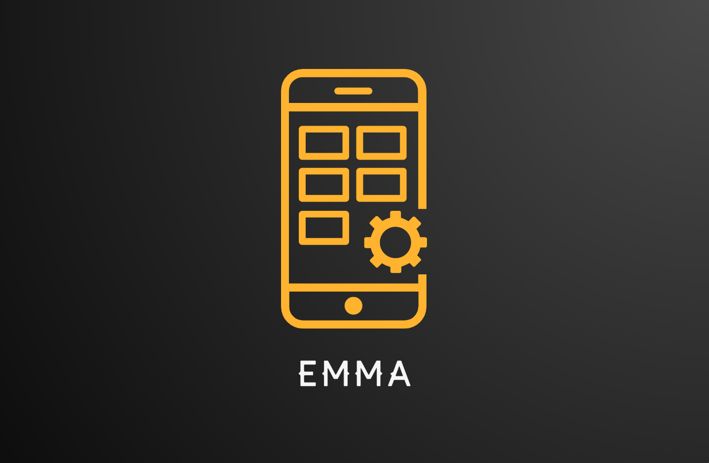

EMMA is am MDM system targeted to Android devices. The system will have an interface to build the desired Android device policy. Built policies could be edited. Ultimately, the policies can be shared with devices. 

Emma will be developed using Python language. The web application will be developed using the Django framework. As for policy integration, Android Enterprise's enterprise mobility management API will be used.

Emma's requirement analysis and design documents and other information can be found on the [Wiki](https://github.com/active-sludge/Emma/wiki) page.

## Features

- [x] Admin panel for policy management
- [x] Create, edit, delete, and share work profiles for Android devices
- [x] Device provisioning
- [x] Google Play access
- [x] Account and app management

## Requirements

- Python >= 3.0
- Django >= 3.2.9

## External Library

- Google API Client

## Contact

iOS Developer - Can Dayan – hcdayan@hotmail.com – [@Linkedin](https://www.linkedin.com/in/can-d/) – [@Medium](https://activesludge.medium.com/) - [@Stackoverflow](https://stackoverflow.com/users/12594970/active-sludge)
